### 1 TCP/IP网络模型基础

### 1.1 TCP/IP网络模型有几层

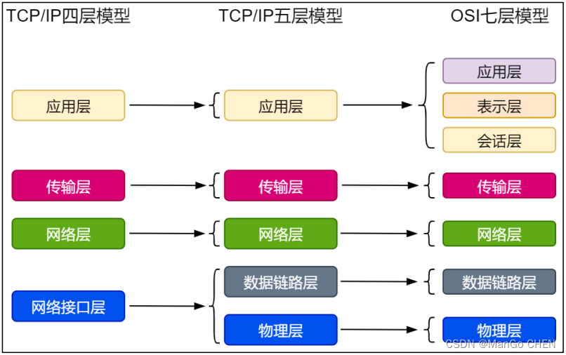

TCP/IP协议并没有严格按照OSI模型来设计，而是将OSI模型中的会话层和表示层合并到应用层，将OSI模型中的数据链路层和物理层合并到网络接口层，所以TCP/IP协议实际使用中只有四层<font color="red">***（应用层、传输层、网络层、网络接口层）***</font>。


- <font color="red">**应用层**</font>：应用层只专注于为用户提供应用功能，比如 HTTP、FTP等。

- <font color="red">**传输层**</font>：传输层有两个传输协议，分别是 **TCP** 和 **UDP**
  - **TCP** 的全称叫**传输控制协议**（Transmission Control Protocol），大部分应用使用的正是 TCP 传输层协议，比如 HTTP 应用层协议。TCP 相比 UDP 多了很多特性，比如流量控制、超时重传、拥塞控制等，这些都是为了保证数据包能可靠地传输给对方。
  - **UDP** 的全称叫**用户数据报协议**（User Datagram Protocol），它相对来说就很简单，简单到只负责发送数据包，不保证数据包是否能抵达对方，但它实时性相对更好，传输效率也高。

当应用传输的数据可能会特别大，所以当传送的数据大小超过<font color="red">**MSS**</font>**（TCP 最大报文段长度）**，就会将数据包分块，这样即使中途有一个分块丢失或损坏了，只需要重新发送这一个分块，而不用重新发送整个数据包。在 TCP 协议中，我们把每个分块称为一个 TCP 段（TCP Segment）。

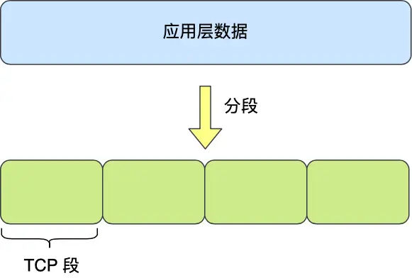

当设备作为接收方时，传输层则要负责把数据包传给应用，但是一台设备上可能会有很多应用在接收或者传输数据，因此需要用一个编号将应用区分开来，这个编号就是<font color="red">**端口**</font>。

传输层的报文中会携带端口号，因此接收方可以识别出该报文是发送给哪个应用。


- <font color="red">**网络层**</font>：网络层最常使用的是 IP 协议（Internet Protocol），IP 协议会将传输层的报文作为数据部分，再加上 IP 包头组装成 IP 报文，如果 IP 报文大小超过 **MTU**（以太网中一般为 1500 字节）就会再次进行分片，得到一个即将发送到网络的 IP 报文。


网络层根据IP给不同的设备区分编号。IP地址分为两类：IPv4和IPv6。IPv4地址是32位的，IPv6地址是128位的。
IPv4分成4段（192.168.100.1），每段8位。

**IP 地址分成两种意义：**

1、一个是**网络号**，负责标识该 IP 地址是属于哪个「子网」的。  
2、一个是**主机号**，负责标识同一「子网」下的不同主机。


**配合子网掩码算出 IP 地址 的网络号和主机号。**

举个例子，比如 10.100.122.0/24，后面的/24表示就是 255.255.255.0 子网掩码，255.255.255.0 二进制是「11111111-11111111-11111111-00000000」。为了简化子网掩码的表示，用/24代替255.255.255.0。


**将 10.100.122.2 和 255.255.255.0 进行按位与运算，就可以得到网络号**

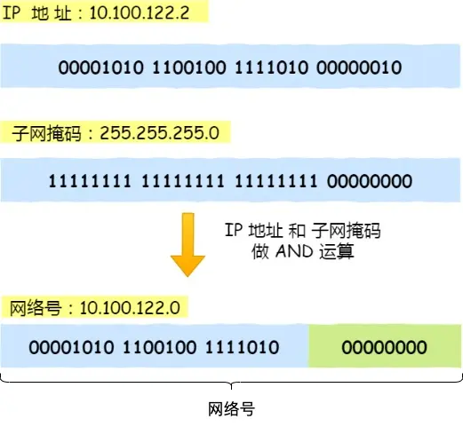


**将 255.255.255.0 取反后与IP地址进行进行按位与运算，就可以得到主机号。**


**寻址**的过程中，先匹配到相同的网络号（表示要找到同一个子网），才会去找对应的主机。
除了寻址能力， IP 协议还有另一个重要的能力就是**路由**。

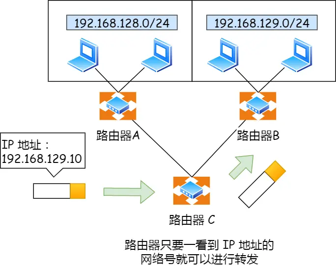


- <font color="red">**网络接口层**</font>：生成了 IP 头部之后，接下来要交给网络接口层（Link Layer）在 IP 头部的前面加上 MAC 头部，并封装成数据帧（Data frame）发送到网络上。

MAC 头部是<font color="red">**以太网**</font>（电脑上的以太网接口，Wi-Fi接口，以太网交换机、路由器上的千兆，万兆以太网口，还有网线，它们都是以太网的组成部分）使用的头部，它包含了接收方和发送方的 MAC 地址等信息

所以说，网络接口层主要为网络层提供「链路级别」传输的服务，负责在以太网、WiFi 这样的底层网络上发送原始数据包


#### 总结


网络接口层的传输单位是帧（frame），IP 层的传输单位是包（packet），TCP 层的传输单位是段（segment），HTTP 的传输单位则是消息或报文（message）。但这些名词并没有什么本质的区分，可以统称为数据包。


### 1.2 键入网址到网页显示，期间发生了什么


#### 1.2.1 HTTP

**解析 URL**


**对 URL 进行解析之后，浏览器确定了 Web 服务器和文件名，接下来就是根据这些信息来生成 HTTP 请求消息了。**


#### 1.2.2 DNS

实际上域名最后还有一个点，比如 www.server.com.，这个最后的一个点代表根域名。

所以域名的层级关系类似一个树状结构：

- 根 DNS 服务器（.）
- 顶级域 DNS 服务器（.com）
- 权威 DNS 服务器（server.com）


**根域**的 DNS 服务器信息保存在互联网中**所有**的 DNS 服务器中。

这样一来，任何 DNS 服务器就都可以找到并访问根域 DNS 服务器了。

因此，客户端只要能够找到任意一台 DNS 服务器，就可以通过它找到根域 DNS 服务器，然后再一路顺藤摸瓜找到位于下层的某台目标 DNS 服务器。

##### 域名解析的工作流程

1、客户端首先会发出一个 DNS 请求，问 www.server.com 的 IP 是啥，并发给本地 DNS 服务器（也就是客户端的 TCP/IP 设置中填写的 DNS 服务器地址）。

2、本地域名服务器收到客户端的请求后，如果缓存里的表格能找到 www.server.com，则它直接返回 IP 地址。如果没有，本地 DNS 会去问它的根域名服务器：“老大， 能告诉我 www.server.com 的 IP 地址吗？” 根域名服务器是最高层次的，它不直接用于域名解析，但能指明一条道路。

3、根 DNS 收到来自本地 DNS 的请求后，发现后置是 .com，说：“www.server.com 这个域名归 .com 区域管理”，我给你 .com 顶级域名服务器地址给你，你去问问它吧。”

4、本地 DNS 收到顶级域名服务器的地址后，发起请求问“老二， 你能告诉我 www.server.com 的 IP 地址吗？”

5、顶级域名服务器说：“我给你负责 www.server.com 区域的权威 DNS 服务器的地址，你去问它应该能问到”。

6、本地 DNS 于是转向问权威 DNS 服务器：“老三，www.server.com对应的IP是啥呀？” server.com 的权威 DNS 服务器，它是域名解析结果的原出处。为啥叫权威呢？就是我的域名我做主。

7、权威 DNS 服务器查询后将对应的 IP 地址 X.X.X.X 告诉本地 DNS。

8、本地 DNS 再将 IP 地址返回客户端，客户端和目标建立连接。


##### 那是不是每次解析域名都要经过那么多的步骤呢？

浏览器会先看自身有没有对这个域名的缓存，如果有，就直接返回，如果没有，就去问操作系统，操作系统也会去看自己的缓存，如果有，就直接返回，如果没有，再去 hosts 文件看，也没有，才会去问「本地 DNS 服务器」。


#### 1.2.3 TCP

**HTTP 是基于 TCP 协议传输的，所以在这我们先了解下 TCP 协议。**

```
TCP 报文头部的格式
```


**源端口号**和**目标端口号**是不可少的，如果没有这两个端口号，数据就不知道应该发给哪个应用。

接下来还有一些状态位。例如 **SYN** 是发起一个连接，**ACK** 是回复，**RST** 是重新连接，**FIN** 是结束连接等。TCP 是面向连接的，因而**双方要维护连接的状态**，这些带状态位的包的发送，会引起双方的状态变更。

```
TCP的三次握手
```


- 一开始，客户端和服务端都处于 CLOSED 状态。先是服务端主动监听某个端口，处于 LISTEN 状态。

- 然后客户端主动发起连接 SYN，之后处于 SYN-SENT 状态。

- 服务端收到发起的连接，返回 SYN，并且 ACK 客户端的 SYN，之后处于 SYN-RCVD 状态。

- 客户端收到服务端发送的 SYN 和 ACK 之后，发送对 SYN 确认的 ACK，之后处于 ESTABLISHED 状态，因为它一发一收成功了。

- 服务端收到 ACK 的 ACK 之后，处于 ESTABLISHED 状态，因为它也一发一收了。

**所以三次握手目的是保证双方都有发送和接收的能力。**


```
TCP 分割数据
```

如果 HTTP 请求消息比较长，超过了 MSS 的长度，这时 TCP 就需要把 HTTP 的数据拆解成一块块的数据发送，而不是一次性发送所有数据。


- **MTU**：一个网络包的最大长度，以太网中一般为 1500 字节。
- **MSS**：除去 IP 和 TCP 头部之后，一个网络包所能容纳的 TCP 数据的最大长度。

数据会被以 MSS 的长度为单位进行拆分，拆分出来的每一块数据都会被放进单独的网络包中。也就是在每个被拆分的数据加上 TCP 头信息，然后交给 IP 模块来发送数据。

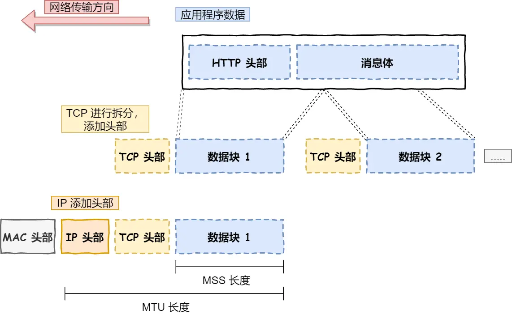


```
TCP 报文生成
```

至此，网络包的报文如下图。

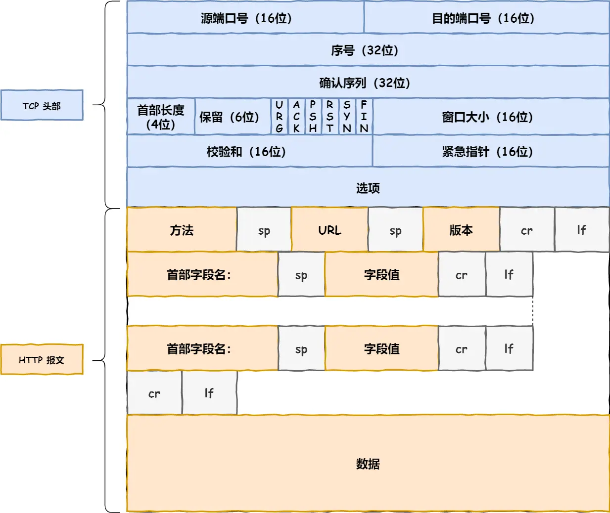

在双方建立了连接后，TCP 报文中的数据部分就是存放 HTTP 头部 + 数据，组装好 TCP 报文之后，就需交给下面的网络层处理。


#### 1.2.4 IP

```
IP 包头格式
```


在 IP 协议里面需要有源地址 IP 和 目标地址 IP：
- 源地址IP，即是客户端输出的 IP 地址；
- 目标地址，即通过 DNS 域名解析得到的 Web 服务器 IP。


```
IP 报文生成
```

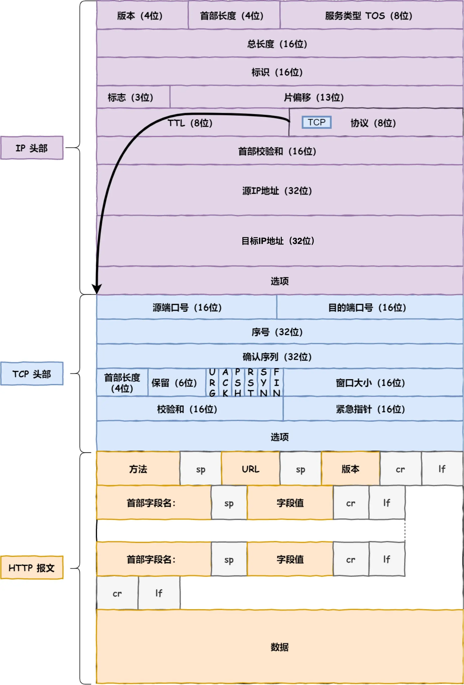


#### 1.2.5 MAC

生成了 IP 头部之后，接下来网络包还需要在 IP 头部的前面加上 MAC 头部。


```
MAC 包头格式
```

MAC 头部是以太网使用的头部，它包含了接收方和发送方的 MAC 地址等信息。

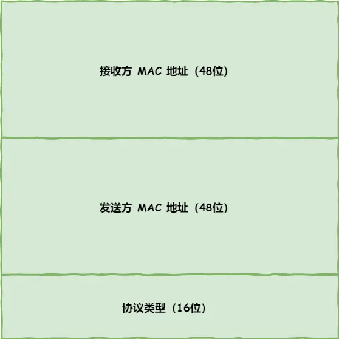

```
MAC 报文生成
```


---


### 2 HTTP常见问题篇

#### 2.1 HTTP基本概念

#### 2.1.1 HTTP 常见的状态码有哪些？


1xx 类状态码属于提示信息，是协议处理中的一种中间状态，实际用到的比较少。

2xx 类状态码表示服务器成功处理了客户端的请求，也是我们最愿意看到的状态。

- 「200 OK」是最常见的成功状态码，表示一切正常。如果是非 HEAD 请求，服务器返回的响应头都会有 body 数据。

- 「204 No Content」也是常见的成功状态码，与 200 OK 基本相同，但响应头没有 body 数据。

- 「206 Partial Content」是应用于 HTTP 分块下载或断点续传，表示响应返回的 body 数据并不是资源的全部，而是其中的一部分，也是服务器处理成功的状态。


3xx 类状态码表示客户端请求的资源发生了变动，需要客户端用新的 URL 重新发送请求获取资源，也就是重定向。

- 「301 Moved Permanently」表示永久重定向，说明请求的资源已经不存在了，需改用新的 URL 再次访问。

- 「302 Found」表示临时重定向，说明请求的资源还在，但暂时需要用另一个 URL 来访问。

- 301 和 302 都会在响应头里使用字段 Location，指明后续要跳转的 URL，浏览器会自动重定向新的 URL。

- 「304 Not Modified」不具有跳转的含义，表示资源未修改，重定向已存在的缓冲文件，也称缓存重定向，也就是告诉客户端可以继续使用缓存资源，用于缓存控制。


4xx 类状态码表示客户端发送的报文有误，服务器无法处理，也就是错误码的含义。

- 「400 Bad Request」表示客户端请求的报文有错误，但只是个笼统的错误。

- 「403 Forbidden」表示服务器禁止访问资源，并不是客户端的请求出错。

- 「404 Not Found」表示请求的资源在服务器上不存在或未找到，所以无法提供给客户端。

5xx 类状态码表示客户端请求报文正确，但是服务器处理时内部发生了错误，属于服务器端的错误码。

- 「500 Internal Server Error」与 400 类型，是个笼统通用的错误码，服务器发生了什么错误，我们并不知道。

- 「501 Not Implemented」表示客户端请求的功能还不支持，类似“即将开业，敬请期待”的意思。

- 「502 Bad Gateway」通常是服务器作为网关或代理时返回的错误码，表示服务器自身工作正常，访问后端服务器发生了错误。

- 「503 Service Unavailable」表示服务器当前很忙，暂时无法响应客户端，类似“网络服务正忙，请稍后重试”的意思。


#### 2.1.2 HTTP 常见字段有哪些？

- Host 字段：客户端发送请求时，用来指定服务器的域名。

```
Host: www.A.com
```

- Content-Length 字段：服务器在返回数据时，表明本次回应的数据长度。

```
Content-Length: 1000
```

如上面则是告诉浏览器，本次服务器回应的数据长度是 1000 个字节，后面的字节就属于下一个回应了。

**HTTP 协议通过设置回车符、换行符作为 HTTP header 的边界，通过 Content-Length 字段作为 HTTP body 的边界，这两个方式都是为了解决“粘包”的问题。**

- Connection 字段：客户端在请求头里面设置 Connection: keep-alive，表示客户端希望与服务器建立**HTTP 长连接**

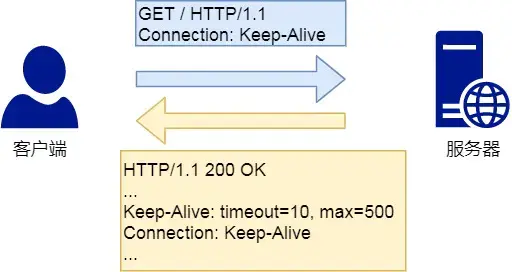

HTTP 长连接的特点是，只要任意一端没有明确提出断开连接，则保持 TCP 连接状态。

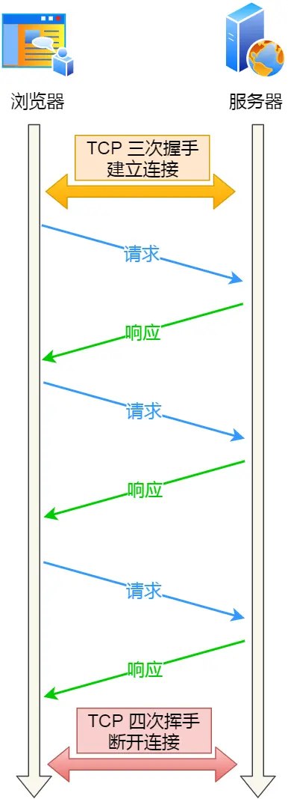

HTTP/1.1 版本的默认连接都是长连接，但为了兼容老版本的 HTTP，需要指定 Connection 首部字段的值为 Keep-Alive。

```
Connection: Keep-Alive
```

- Content-Type 字段

Content-Type 字段用于服务器回应时，告诉客户端，本次数据是什么格式。

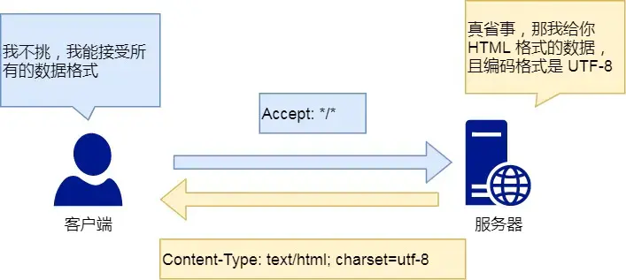

```
Content-Type: text/html; Charset=utf-8
```

上面的类型表明，发送的是网页，而且编码是UTF-8。

客户端请求的时候，可以使用 Accept 字段声明自己可以接受哪些数据格式。

```
Accept: */*
```
上面的意思是，客户端可以接受任意格式的数据。

- Content-Encoding 字段：服务器回应时，告诉客户端，本次回应的数据采用了什么压缩格式。

```
Content-Encoding: gzip
```

#### 2.2 GET和POST

#### 2.2.1 GET 和 POST 有什么区别？

**GET**  
根据 RFC 规范，GET 的语义是**从服务器获取指定的资源**，这个资源可以是静态的文本、页面、图片视频等。GET 请求的参数位置一般是写在 URL 中，URL 规定只能支持 ASCII，所以 GET 请求的参数只允许 ASCII 字符 ，而且浏览器会对 URL 的长度有限制（HTTP协议本身对 URL长度并没有做任何规定）。

**POST**  
根据 RFC 规范，POST 的语义是根据请求负荷（报文body）对指定的资源做出处理，具体的处理方式视资源类型而不同。POST 请求携带数据的位置一般是写在报文 body 中，body 中的数据可以是任意格式的数据，只要客户端与服务端协商好即可，而且浏览器不会对 body 大小做限制。

#### 2.2.2 GET 和 POST 方法都是安全和幂等的吗？

先说明下安全和幂等的概念：
- 在 HTTP 协议里，所谓的「安全」是指请求方法不会「破坏」服务器上的资源。

- 所谓的「幂等」，意思是多次执行相同的操作，结果都是「相同」的。

RFC 规范定义的语义来看：
- **GET 方法就是安全且幂等的**，因为它是「只读」操作，无论操作多少次，服务器上的数据都是安全的，且每次的结果都是相同的。所以，可以对 GET 请求的数据做缓存，这个缓存可以做到浏览器本身上（彻底避免浏览器发请求），也可以做到代理上（如nginx），而且在浏览器中 GET 请求可以保存为书签。

- **POST** 因为是「新增或提交数据」的操作，会修改服务器上的资源，所以是不安全的，且多次提交数据就会创建多个资源，所以**不是幂等的**。所以，浏览器一般不会缓存 POST 请求，也不能把 POST 请求保存为书签。


#### 2.3 HTTP 缓存技术

#### 2.3.1 HTTP 缓存有哪些实现方式？

HTTP 缓存有两种实现方式，分别是**强制缓存**和**协商缓存**。

##### 什么是强制缓存？

强缓存指的是只要浏览器判断缓存没有过期，则直接使用浏览器的本地缓存，决定是否使用缓存的主动性在于浏览器这边。

如下图中，返回的是 200 状态码，但在 size 项中标识的是 from disk cache，就是使用了强制缓存。

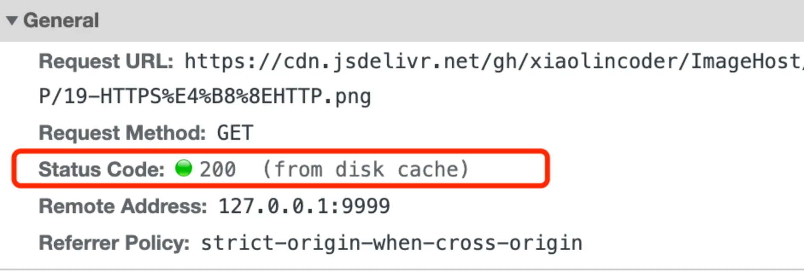

强缓存是利用下面这两个 HTTP 响应头部（Response Header）字段实现的，它们都用来表示资源在客户端缓存的有效期：

- Cache-Control， 是一个相对时间；
- Expires，是一个绝对时间；

如果 HTTP 响应头部同时有 Cache-Control 和 Expires 字段的话，**Cache-Control 的优先级高于 Expires**。

Cache-control 选项更多一些，设置更加精细，所以建议使用 Cache-Control 来实现强缓存。具体的实现流程如下：

- 当浏览器第一次请求访问服务器资源时，服务器会在返回这个资源的同时，在 Response 头部加上 Cache-Control，Cache-Control 中设置了过期时间大小；
- 浏览器再次请求访问服务器中的该资源时，会先通过请求资源的时间与 Cache-Control 中设置的过期时间大小，来计算出该资源是否过期，如果没有，则使用该缓存，否则重新请求服务器；
- 服务器再次收到请求后，会再次更新 Response 头部的 Cache-Control。


##### 什么是协商缓存？

当我们在浏览器使用开发者工具的时候，你可能会看到过某些请求的响应码是 304，这个是告诉浏览器可以使用本地缓存的资源，**通常这种通过服务端告知客户端是否可以使用缓存的方式被称为协商缓存**。


协商缓存可以基于两种头部来实现。

第一种：请求头部中的 **If-Modified-Since** 字段与响应头部中的 **Last-Modified** 字段实现，这两个字段的意思是：

- 响应头部中的 Last-Modified：标示这个响应资源的最后修改时间；

- 请求头部中的 If-Modified-Since：当资源过期了，发现响应头中具有 Last-Modified 声明，则再次发起请求的时候带上 Last-Modified 的时间，服务器收到请求后发现有 If-Modified-Since 则与被请求资源的最后修改时间进行对比（Last-Modified），如果最后修改时间较新（大），说明资源又被改过，则返回最新资源，HTTP 200 OK；如果最后修改时间较旧（小），说明资源无新修改，响应 HTTP 304 走缓存。


第二种：请求头部中的 **If-None-Match** 字段与响应头部中的 **ETag** 字段，这两个字段的意思是：

- 响应头部中 Etag：唯一标识响应资源；

- 请求头部中的 If-None-Match：当资源过期时，浏览器发现响应头里有 Etag，则再次向服务器发起请求时，会将请求头 If-None-Match 值设置为 Etag 的值。服务器收到请求后进行比对，如果资源没有变化返回 304，如果资源变化了返回 200。


**第一种实现方式是基于时间实现的**，**第二种实现方式是基于一个唯一标识实现的**，相对来说后者可以更加准确地判断文件内容是否被修改，避免由于时间篡改导致的不可靠问题。

如果在第一次请求资源的时候，服务端返回的 HTTP 响应头部同时有 Etag 和 Last-Modified 字段，那么客户端再下一次请求的时候，如果带上了 ETag 和 Last-Modified 字段信息给服务端，这时 Etag 的优先级更高，也就是服务端先会判断 Etag 是否变化了，如果 Etag 有变化就不用在判断 Last-Modified 了，如果 Etag 没有变化，然后再看 Last-Modified。


**为什么 ETag 的优先级更高？**

这是因为 ETag 主要能解决 Last-Modified 几个比较难以解决的问题：

1、在没有修改文件内容情况下文件的最后修改时间可能也会改变，这会导致客户端认为这文件被改动了，从而重新请求；

2、可能有些文件是在秒级以内修改的，If-Modified-Since 能检查到的粒度是秒级的，使用 Etag就能够保证这种需求下客户端在 1 秒内能刷新多次；

3、有些服务器不能精确获取文件的最后修改时间。


**注意，协商缓存这两个字段都需要配合强制缓存中 Cache-Control 字段来使用，只有在未能命中强制缓存的时候，才能发起带有协商缓存字段的请求。**

下图是强制缓存和协商缓存的工作流程：


当使用 ETag 字段实现的协商缓存的过程：

- 当浏览器第一次请求访问服务器资源时，服务器会在返回这个资源的同时，在 Response 头部加上 ETag 唯一标识，这个唯一标识的值是根据当前请求的资源生成的；

- 当浏览器再次请求访问服务器中的该资源时，首先会先检查强制缓存是否过期：
  - 如果没有过期，则直接使用本地缓存；
  - 如果缓存过期了，会在 Request 头部加上 If-None-Match 字段，该字段的值就是 ETag 唯一标识；

- 服务器再次收到请求后，会根据请求中的 If-None-Match 值与当前请求的资源生成的唯一标识进行比较：
  - 如果值相等，则返回 304 Not Modified，不会返回资源；
  - 如果不相等，则返回 200 状态码和返回资源，并在 Response 头部加上新的 ETag 唯一标识；

- 如果浏览器收到 304 的请求响应状态码，则会从本地缓存中加载资源，否则更新资源。


#### 2.3 HTTP 特性

#### 2.3.1 HTTP/1.1 的特点

- 无状态
  - 好处：因为服务器不会去记忆 HTTP 的状态，所以不需要额外的资源来记录状态信息，这能减轻服务器的负担
  - 坏处：无法记录状态，导致在完成有关联性的操作时会非常麻烦。--采用 Cookie 解决
- 明文传输
  - 容易被窃听和篡改 -- 用 HTTPS 的方式解决，也就是通过引入 SSL/TLS 层。


#### 2.3.2 HTTP/1.1 的性能如何？

- 长连接


- 管道网络传输（没有被使用）

- 队头阻塞

因为当顺序发送的请求序列中的一个请求因为某种原因被阻塞时，在后面排队的所有请求也一同被阻塞了，会招致客户端一直请求不到数据

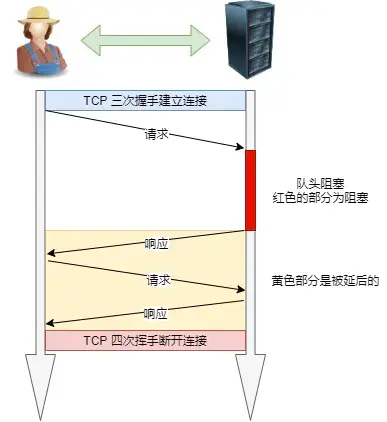


#### 2.4 HTTP 与 HTTPS

#### 2.4.1 HTTP 与 HTTPS 有哪些区别？

- HTTP 是超文本传输协议，信息是明文传输，存在安全风险的问题。HTTPS 则解决 HTTP 不安全的缺陷，在 TCP 和 HTTP 网络层之间**加入了 SSL/TLS 安全协议**，使得报文能够加密传输。

- HTTP 连接建立相对简单， TCP 三次握手之后便可进行 HTTP 的报文传输。而 HTTPS 在 TCP 三次握手之后，还需进行 SSL/TLS 的握手过程，才可进入加密报文传输。

- 两者的默认端口不一样，HTTP 默认端口号是 **80**，HTTPS 默认端口号是 **443**。

- HTTPS 协议需要向 CA（证书权威机构）申请数字证书，来保证服务器的身份是可信的。

#### 2.4.2 HTTPS 解决的三个风险

- **机密性**：**混合加密**的方式实现信息的机密性，解决了窃听的风险。

- **完整性**：**摘要算法**的方式来实现完整性，它能够为数据生成独一无二的「指纹」，指纹用于校验数据的完整性，解决了篡改的风险。

- **身份认证**：**数字证书**的方式来实现身份认证，解决了伪装的风险。


#### 混合加密

HTTPS 采用的是对称加密和非对称加密结合的「混合加密」方式：

- 在通信建立前采用非对称加密的方式交换「会话秘钥」，后续就不再使用非对称加密。

- 在通信过程中全部使用对称加密的「会话秘钥」的方式加密明文数据。

采用「混合加密」的方式的原因：

- 对称加密只使用一个密钥，运算速度快，密钥必须保密，无法做到安全的密钥交换。
- 非对称加密使用两个密钥：公钥和私钥，公钥可以任意分发而私钥保密，解决了密钥交换问题但速度慢。


#### 摘要算法 + 数字签名

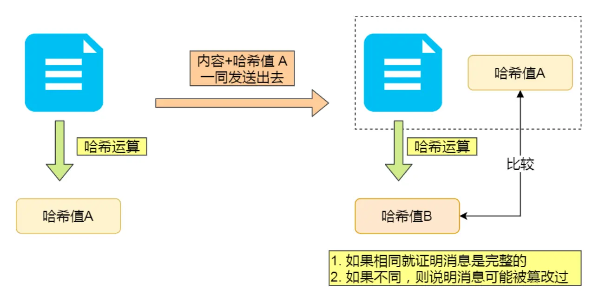

通过哈希算法可以确保内容不会被篡改，**但是并不能保证「内容 + 哈希值」不会被中间人替换，因为这里缺少对客户端收到的消息是否来源于服务端的证明。**


那为了避免这种情况，计算机里会用非对称加密算法来解决，共有两个密钥：

- 一个是公钥，这个是可以公开给所有人的；

- 一个是私钥，这个必须由本人管理，不可泄露。
这两个密钥可以双向加解密的，比如可以用公钥加密内容，然后用私钥解密，也可以用私钥加密内容，公钥解密内容。

流程的不同，意味着目的也不相同：

- **公钥加密，私钥解密**。这个目的是为了**保证内容传输的安全**，因为被公钥加密的内容，其他人是无法解密的，只有持有私钥的人，才能解密出实际的内容；

- **私钥加密，公钥解密**。这个目的是为了**保证消息不会被冒充**，因为私钥是不可泄露的，如果公钥能正常解密出私钥加密的内容，就能证明这个消息是来源于持有私钥身份的人发送的。


一般我们不会用非对称加密来加密实际的传输内容，因为非对称加密的计算比较耗费性能的。

所以**非对称加密的用途主要在于通过「私钥加密，公钥解密」的方式，来确认消息的身份**，我们常说的**数字签名算法**，就是用的是这种方式，不过私钥加密内容不是内容本身，而是**对内容的哈希值加密**。


#### 数字证书

前面我们知道：

- 可以通过哈希算法来保证消息的完整性；

- 可以通过数字签名来保证消息的来源可靠性（能确认消息是由持有私钥的一方发送的）；

但是这还远远不够，还缺少身份验证的环节，万一公钥是被**伪造**的呢？

正是通过了一个权威的机构来证明公钥身份，所以你的伪造公私钥这个小伎俩就没用了。

在计算机里，这个权威的机构就是 CA （数字证书认证机构），将服务器公钥放在数字证书（由数字证书认证机构颁发）中，只要证书是可信的，公钥就是可信的。


#### 2.4.3 HTTPS 是如何建立连接的？其间交互了什么？

SSL/TLS 协议基本流程：

- 客户端向服务器索要并验证服务器的公钥。
- 双方协商生产「会话秘钥」。
- 双方采用「会话秘钥」进行加密通信。

前两步也就是 SSL/TLS 的建立过程，也就是 TLS 握手阶段。

TLS 的「握手阶段」涉及四次通信，使用不同的密钥交换算法，TLS 握手流程也会不一样的，现在常用的密钥交换算法有两种：**RSA** 算法和 **ECDHE** 算法。

基于 RSA 算法的 TLS 握手过程比较容易理解，所以这里先用这个给大家展示 TLS 握手过程，如下图：

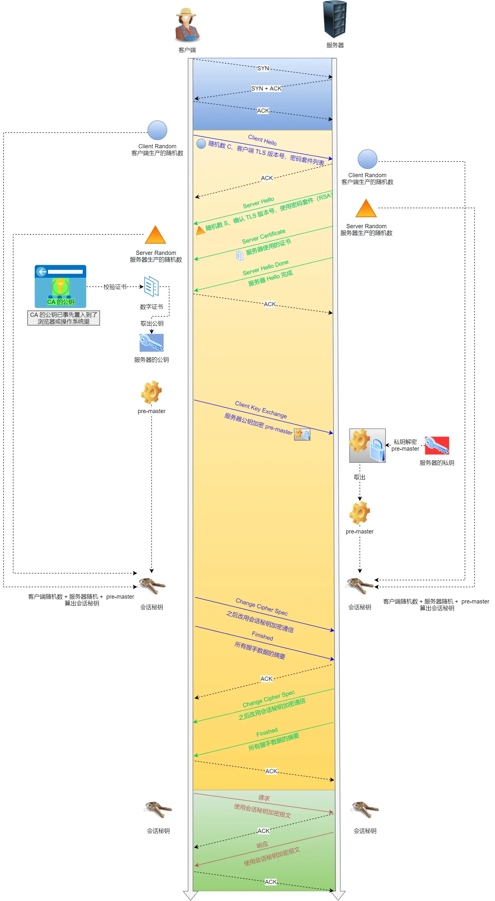


TLS 协议建立的详细流程：

1. ClientHello

首先，由客户端向服务器发起加密通信请求，也就是 ClientHello 请求。

在这一步，客户端主要向服务器发送以下信息：

（1）客户端支持的 TLS 协议版本，如 TLS 1.2 版本。

（2）客户端生产的随机数（Client Random），后面用于生成「会话秘钥」条件之一。

（3）客户端支持的密码套件列表，如 RSA 加密算法。

2. SeverHello

服务器收到客户端请求后，向客户端发出响应，也就是 SeverHello。服务器回应的内容有如下内容：

（1）确认 TLS 协议版本，如果浏览器不支持，则关闭加密通信。

（2）服务器生产的随机数（Server Random），也是后面用于生产「会话秘钥」条件之一。

（3）确认的密码套件列表，如 RSA 加密算法。

（4）服务器的数字证书。

3.客户端回应

客户端收到服务器的回应之后，首先通过浏览器或者操作系统中的 CA 公钥，确认服务器的数字证书的真实性。

如果证书没有问题，客户端会从数字证书中取出服务器的公钥，然后使用它加密报文，向服务器发送如下信息：

（1）一个随机数（pre-master key）。该随机数会被服务器公钥加密。

（2）加密通信算法改变通知，表示随后的信息都将用「会话秘钥」加密通信。

（3）客户端握手结束通知，表示客户端的握手阶段已经结束。这一项同时把之前所有内容的发生的数据做个摘要，用来供服务端校验。

上面第一项的随机数是整个握手阶段的第三个随机数，会发给服务端，所以这个随机数客户端和服务端都是一样的。

服务器和客户端有了这三个随机数（Client Random、Server Random、pre-master key），接着就用双方协商的加密算法，各自生成本次通信的「会话秘钥」。

4. 服务器的最后回应

服务器收到客户端的第三个随机数（pre-master key）之后，通过协商的加密算法，计算出本次通信的「会话秘钥」。

然后，向客户端发送最后的信息：

（1）加密通信算法改变通知，表示随后的信息都将用「会话秘钥」加密通信。

（2）服务器握手结束通知，表示服务器的握手阶段已经结束。这一项同时把之前所有内容的发生的数据做个摘要，用来供客户端校验。

至此，整个 TLS 的握手阶段全部结束。接下来，客户端与服务器进入加密通信，就完全是使用普通的 HTTP 协议，只不过用「会话秘钥」加密内容。

```
不过，基于 RSA 算法的 HTTPS 存在「前向安全」的问题：如果服务端的私钥泄漏了，过去被第三方截获的所有 TLS 通讯密文都会被破解。
```


#### 2.4.4 客户端校验数字证书的流程是怎样的？

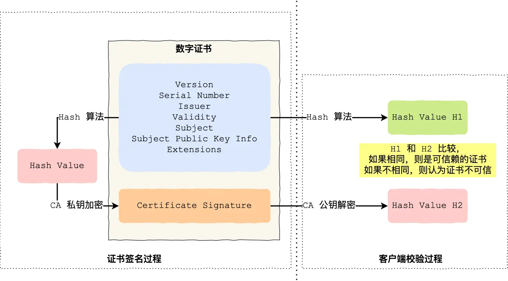

CA 签发证书的过程，如上图左边部分：

- 首先 CA 会把持有者的公钥、用途、颁发者、有效时间等信息打成一个包，然后对这些信息进行 Hash 计算，得到一个 Hash 值；

- 然后 CA 会使用自己的私钥将该 Hash 值加密，生成 Certificate Signature，也就是 CA 对证书做了签名；

- 最后将 Certificate Signature 添加在文件证书上，形成数字证书；


客户端校验服务端的数字证书的过程，如上图右边部分：

- 首先客户端会使用同样的 Hash 算法获取该证书的 Hash 值 H1；

- 通常浏览器和操作系统中集成了 CA 的公钥信息，浏览器收到证书后可以使用 CA 的公钥解密 Certificate Signature 内容，得到一个 Hash 值 H2 ；

- 最后比较 H1 和 H2，如果值相同，则为可信赖的证书，否则则认为证书不可信。


但事实上，证书的验证过程中还存在一个**证书信任链的问题**，因为我们向 CA 申请的证书一般不是根证书签发的，而是由中间证书签发的，比如百度的证书，从下图你可以看到，证书的层级有三级：


对于这种三级层级关系的证书的验证过程如下：

- 客户端收到 baidu.com 的证书后，发现这个证书的签发者不是根证书，就无法根据本地已有的根证书中的公钥去验证 baidu.com 证书是否可信。于是，客户端根据 baidu.com 证书中的签发者，找到该证书的颁发机构是 “GlobalSign Organization Validation CA - SHA256 - G2”，然后向 CA 请求该中间证书。

- 请求到证书后发现 “GlobalSign Organization Validation CA - SHA256 - G2” 证书是由 “GlobalSign Root CA” 签发的，由于 “GlobalSign Root CA” 没有再上级签发机构，说明它是根证书，也就是自签证书。应用软件会检查此证书有否已预载于根证书清单上，如果有，则可以利用根证书中的公钥去验证 “GlobalSign Organization Validation CA - SHA256 - G2” 证书，如果发现验证通过，就认为该中间证书是可信的。

- “GlobalSign Organization Validation CA - SHA256 - G2” 证书被信任后，可以使用 “GlobalSign Organization Validation CA - SHA256 - G2” 证书中的公钥去验证 baidu.com 证书的可信性，如果验证通过，就可以信任 baidu.com 证书。

在这四个步骤中，最开始客户端只信任根证书 GlobalSign Root CA 证书的，然后 “GlobalSign Root CA” 证书信任 “GlobalSign Organization Validation CA - SHA256 - G2” 证书，而 “GlobalSign Organization Validation CA - SHA256 - G2” 证书又信任 baidu.com 证书，于是客户端也信任 baidu.com 证书。

总括来说，由于用户信任 GlobalSign，所以由 GlobalSign 所担保的 baidu.com 可以被信任，另外由于用户信任操作系统或浏览器的软件商，所以由软件商预载了根证书的 GlobalSign 都可被信任。

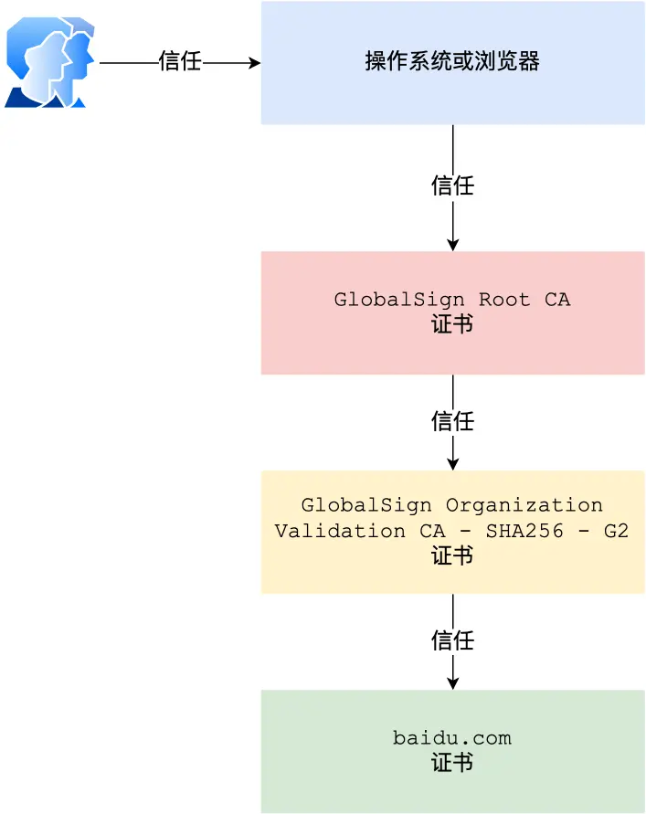

操作系统里一般都会内置一些根证书，比如 MAC 电脑里内置的根证书有这么多：

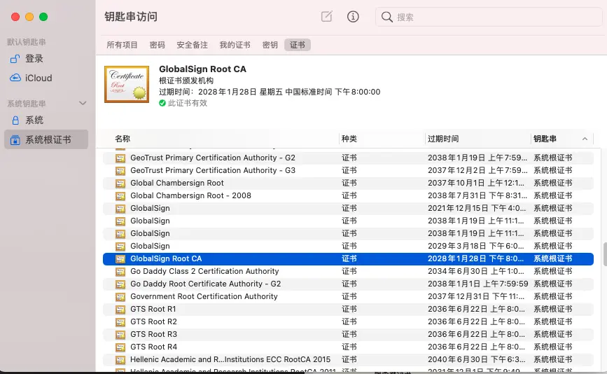


#### 2.5 HTTP/1.1、HTTP/2、HTTP/3 演变

#### 2.5.1 HTTP/1.1 相比 HTTP/1.0 提高了什么性能？

- 使用长连接的方式改善了 HTTP/1.0 短连接造成的性能开销。
- 支持管道（pipeline）网络传输，只要第一个请求发出去了，不必等其回来，就可以发第二个请求出去，可以减少整体的响应时间。


#### 2.5.2 HTTP/2 做了什么优化？

HTTP/2 协议是基于 HTTPS 的，所以 HTTP/2 的安全性也是有保障的。


那 HTTP/2 相比 HTTP/1.1 性能上的改进：

- 头部压缩
- 二进制格式
- 并发传输
- 服务器主动推送资源


1. 头部压缩

HTTP/2 会压缩头（Header）如果你同时发出多个请求，他们的头是一样的或是相似的，那么，协议会帮你消除重复的部分。

这就是所谓的 HPACK 算法：在客户端和服务器同时维护一张头信息表，所有字段都会存入这个表，生成一个索引号，以后就不发送同样字段了，只发送索引号，这样就提高速度了。

2. 二进制格式

HTTP/2 不再像 HTTP/1.1 里的纯文本形式的报文，而是全面采用了二进制格式，头信息和数据体都是二进制，并且统称为帧（frame）：头信息帧（Headers Frame）和数据帧（Data Frame）。

比如状态码 200 ，在 HTTP/1.1 是用 '2''0''0' 三个字符来表示（二进制：00110010 00110000 00110000），共用了 3 个字节。
在 HTTP/2 对于状态码 200 的二进制编码是 10001000，只用了 1 字节就能表示，相比于 HTTP/1.1 节省了 2 个字节


3. 并发传输

我们都知道 HTTP/1.1 的实现是基于请求-响应模型的。同一个连接中，HTTP 完成一个事务（请求与响应），才能处理下一个事务，也就是说在发出请求等待响应的过程中，是没办法做其他事情的，如果响应迟迟不来，那么后续的请求是无法发送的，也造成了队头阻塞的问题。

而 HTTP/2 引出了 Stream 概念，多个 Stream 复用在一条 TCP 连接。


从上图可以看到，1 个 TCP 连接包含多个 Stream，Stream 里可以包含 1 个或多个 Message，Message 对应 HTTP/1 中的请求或响应，由 HTTP 头部和包体构成。Message 里包含一条或者多个 Frame，Frame 是 HTTP/2 最小单位，以二进制压缩格式存放 HTTP/1 中的内容（头部和包体）。

针对不同的 HTTP 请求用独一无二的 Stream ID 来区分，接收端可以通过 Stream ID 有序组装成 HTTP 消息，不同 Stream 的帧是可以乱序发送的，因此可以并发不同的 Stream ，也就是 HTTP/2 可以并行交错地发送请求和响应。

比如下图，服务端并行交错地发送了两个响应： Stream 1 和 Stream 3，这两个 Stream 都是跑在一个 TCP 连接上，客户端收到后，会根据相同的 Stream ID 有序组装成 HTTP 消息。


使用HTTP/1，应该会有如下的输出：

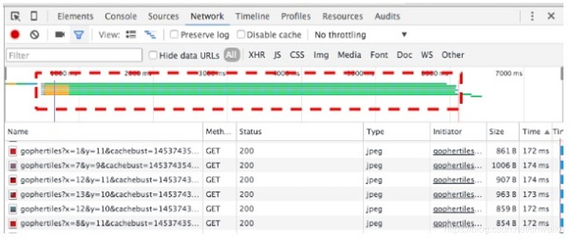

浏览器会并行打开多个HTTP/1.x连接来加速页面加载。不同的浏览器对于针对统一域名并发打开的连接数量有不同的限制，基本上都会支持6个左右不同的连接

当使用HTTP/2的时候，会看到浏览器使用单个多路复用的连接，带来更快的加载时间。

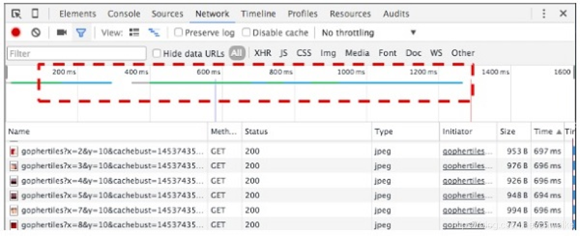

4、服务器推送

HTTP/2 还在一定程度上改善了传统的「请求 - 应答」工作模式，服务端不再是被动地响应，可以主动向客户端发送消息。

例如js可以通过EventSource接口接收服务端推送的消息，而不需要客户端轮询服务端。

```js
var source = new EventSource('/events');
source.onmessage = function(event) {
  console.log(event.data);
};
```


#### 2.5.3 HTTP/3 做了哪些优化？

前面我们知道了 HTTP/1.1 和 HTTP/2 都有队头阻塞的问题：

- HTTP/1.1 中的管道（ pipeline）虽然解决了请求的队头阻塞，但是没有解决响应的队头阻塞，因为服务端需要按顺序响应收到的请求，如果服务端处理某个请求消耗的时间比较长，那么只能等响应完这个请求后， 才能处理下一个请求，这属于 HTTP 层队头阻塞。

- HTTP/2 虽然通过多个请求复用一个 TCP 连接解决了 HTTP 的队头阻塞 ，但是一旦发生丢包，就会阻塞住所有的 HTTP 请求，这属于 TCP 层队头阻塞。


HTTP/2 队头阻塞的问题是因为 TCP，所以 **HTTP/3 把 HTTP 下层的 TCP 协议改成了 UDP！**

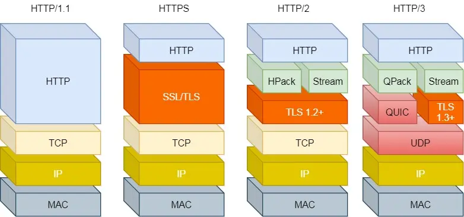


UDP 发送是不管顺序，也不管丢包的，所以不会出现像 HTTP/2 队头阻塞的问题。大家都知道 UDP 是不可靠传输的，**但基于 UDP 的 QUIC 协议 可以实现类似 TCP 的可靠性传输**。

QUIC 有以下 3 个特点。

- 无队头阻塞

- 更快的连接建立

- 连接迁移


1、无队头阻塞

QUIC 协议也有类似 HTTP/2 Stream 与多路复用的概念，也是可以在同一条连接上并发传输多个 Stream，Stream 可以认为就是一条 HTTP 请求。

QUIC 有自己的一套机制可以保证传输的可靠性的。当某个流发生丢包时，只会阻塞这个流，其他流不会受到影响，因此不存在队头阻塞问题。这与 HTTP/2 不同，HTTP/2 只要某个流中的数据包丢失了，其他流也会因此受影响。

所以，QUIC 连接上的多个 Stream 之间并没有依赖，都是独立的，某个流发生丢包了，只会影响该流，其他流不受影响。


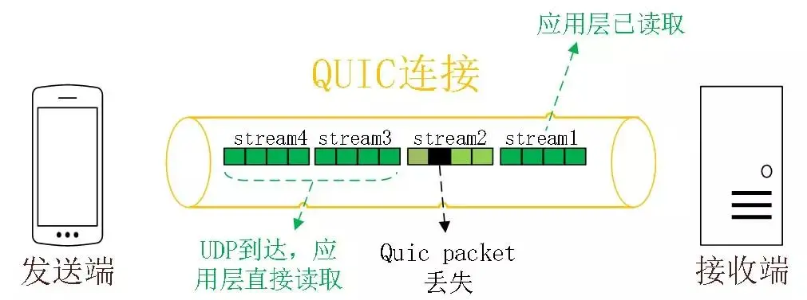


2、更快的连接建立

对于 HTTP/1 和 HTTP/2 协议，TCP 和 TLS 是分层的，分别属于内核实现的传输层、openssl 库实现的表示层，因此它们难以合并在一起，需要分批次来握手，先 TCP 握手，再 TLS 握手。

HTTP/3 在传输数据前虽然需要 QUIC 协议握手，但是这个握手过程只需要 1 RTT，握手的目的是为确认双方的「连接 ID」，连接迁移就是基于连接 ID 实现的。

但是 HTTP/3 的 QUIC 协议并不是与 TLS 分层，而是 QUIC 内部包含了 TLS，它在自己的帧会携带 TLS 里的“记录”，再加上 QUIC 使用的是 TLS/1.3，因此仅需 1 个 RTT 就可以「同时」完成建立连接与密钥协商，如下图：


甚至，在第二次连接的时候，应用数据包可以和 QUIC 握手信息（连接信息 + TLS 信息）一起发送，达到 0-RTT 的效果。

如下图右边部分，HTTP/3 当会话恢复时，有效负载数据与第一个数据包一起发送，可以做到 0-RTT（下图的右下角）：


3、连接迁移

基于 TCP 传输协议的 HTTP 协议，由于是通过四元组（源 IP、源端口、目的 IP、目的端口）确定一条 TCP 连接。


那么当移动设备的网络从 4G 切换到 WIFI 时，意味着 **IP 地址变化了，那么就必须要断开连接，然后重新建立连接**。而建立连接的过程包含 TCP 三次握手和 TLS 四次握手的时延，以及 TCP 慢启动的减速过程，给用户的感觉就是网络突然卡顿了一下，因此连接的迁移成本是很高的。

而 QUIC 协议没有用四元组的方式来“绑定”连接，而是通过**连接 ID** 来标记通信的两个端点，客户端和服务器可以各自选择一组 ID 来标记自己，因此即使移动设备的网络变化后，导致 IP 地址变化了，**只要仍保有上下文信息（比如连接 ID、TLS 密钥等）**，就可以“无缝”地复用原连接，消除重连的成本，没有丝毫卡顿感，达到了连接迁移的功能。


### IP

#### 3.1 localhost、127.0.0.1和0.0.0.0

- 127.0.0.1：所有以127开头的都是回环地址，是一个特殊的ipv4地址，表示本机地址。

- localhost：是一个域名，默认会把它解析为 127.0.0.1 ，也可以在 /etc/hosts 文件下进行修改。

- 0.0.0.0：表示本机上的所有IPV4地址，不是一个有效的的IPv4地址。如果本机上有2个ip地址，如127.0.0.1 和 192.168.31.6。如果我们的服务器监听的是0.0.0.0，那么我们就可以通过这2个ip地址都可以访问到我们的服务器。


### TCP

#### 4.1 TCP的基本知识

#### 4.1.1 TCP 头格式有哪些？


**序列号**：在建立连接时由计算机生成的随机数作为其初始值，通过 SYN 包传给接收端主机，每发送一次数据，就「累加」一次该「数据字节数」的大小。用来解决网络包乱序问题。

**确认应答号**：指下一次「期望」收到的数据的序列号，发送端收到这个确认应答以后可以认为在这个序号以前的数据都已经被正常接收。用来解决丢包的问题。

控制位：

- ACK：该位为 1 时，「确认应答」的字段变为有效，TCP 规定除了最初建立连接时的 SYN 包之外该位必须设置为 1 。
- RST：该位为 1 时，表示 TCP 连接中出现异常必须强制断开连接。
- SYN：该位为 1 时，表示希望建立连接，并在其「序列号」的字段进行序列号初始值的设定。
- FIN：该位为 1 时，表示今后不会再有数据发送，希望断开连接。当通信结束希望断开连接时，通信双方的主机之间就可以相互交换 FIN 位为 1 的 TCP 段。


#### 4.1.2 为什么需要 TCP 协议？ TCP 工作在哪一层？

IP 层是「不可靠」的，它不保证网络包的交付、不保证网络包的按序交付、也不保证网络包中的数据的完整性。

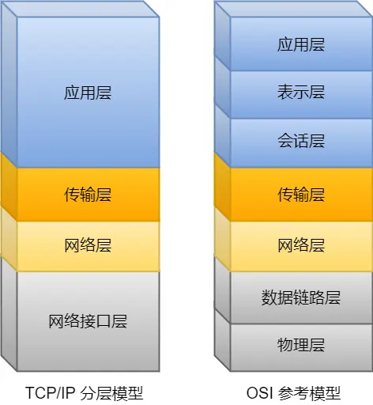

如果需要保障网络数据包的可靠性，那么就需要由上层（传输层）的 TCP 协议来负责。

因为 TCP 是一个工作在传输层的可靠数据传输的服务，它能确保接收端接收的网络包是**无损坏、无间隔、非冗余和按序的**。


#### 4.1.3 什么是 TCP ？

TCP 是面向连接的、可靠的、基于字节流的传输层通信协议。


- **面向连接**：一定是「一对一」才能连接，不能像 UDP 协议可以一个主机同时向多个主机发送消息，也就是一对多是无法做到的；

- **可靠的**：无论的网络链路中出现了怎样的链路变化，TCP 都可以保证一个报文一定能够到达接收端；

- **字节流**：用户消息通过 TCP 协议传输时，消息可能会被操作系统「分组」成多个的 TCP 报文，如果接收方的程序如果不知道「消息的边界」，是无法读出一个有效的用户消息的。并且 TCP 报文是「有序的」，当「前一个」TCP 报文没有收到的时候，即使它先收到了后面的 TCP 报文，那么也不能扔给应用层去处理，同时对「重复」的 TCP 报文会自动丢弃。


#### 4.1.4 什么是 TCP 连接？

RFC 793 是如何定义「连接」的：

**用于保证可靠性和流量控制维护的某些状态信息，这些信息的组合，包括 Socket、序列号和窗口大小称为连接**

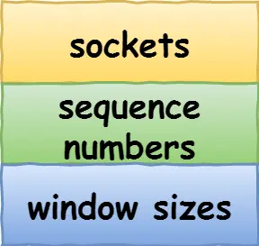

所以我们可以知道，建立一个 TCP 连接是需要客户端与服务端达成上述三个信息的共识。

- Socket：由 IP 地址和端口号组成
- 序列号：用来解决乱序问题等
- 窗口大小：用来做流量控制


#### 4.1.5 如何唯一确定一个 TCP 连接呢？

TCP 四元组可以唯一的确定一个连接，四元组包括如下：

- 源地址
- 源端口
- 目的地址
- 目的端口


#### 4.1.6 UDP 和 TCP 有什么区别呢？分别的应用场景是？

- UDP 不提供复杂的控制机制，利用 IP 提供面向「无连接」的通信服务。

- UDP 协议真的非常简，头部只有 8 个字节（64 位），UDP 的头部格式如下：

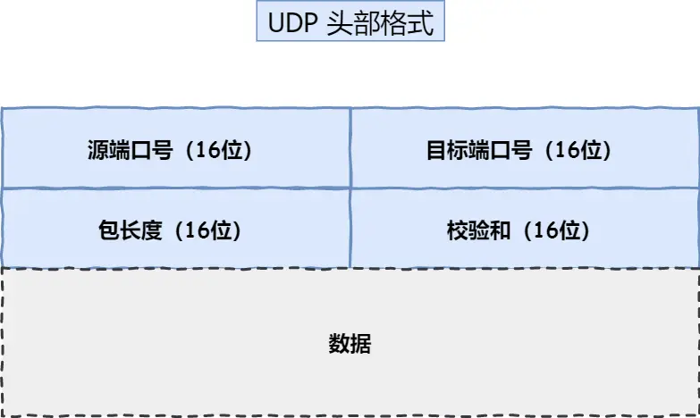

- 目标和源端口：主要是告诉 UDP 协议应该把报文发给哪个进程。
- 包长度：该字段保存了 UDP 首部的长度跟数据的长度之和。
- 校验和：校验和是为了提供可靠的 UDP 首部和数据而设计，防止收到在网络传输中受损的 UDP 包。


#### 4.1.7 TCP 和 UDP 区别：

1. 连接  
TCP 是面向连接的传输层协议，传输数据前先要建立连接。  
UDP 是不需要连接，即刻传输数据。

2. 服务对象  
TCP 是一对一的两点服务，即一条连接只有两个端点。  
UDP 支持一对一、一对多、多对多的交互通信

3. 可靠性  
TCP 是可靠交付数据的，数据可以无差错、不丢失、不重复、按序到达。  
UDP 是尽最大努力交付，不保证可靠交付数据。但是我们可以基于 UDP 传输协议实现一个可靠的传输协议，比如 QUIC 协议，具体可以参见这篇文章：如何基于 UDP 协议实现可靠传输？(opens new window)

4. 拥塞控制、流量控制  
TCP 有拥塞控制和流量控制机制，保证数据传输的安全性。  
UDP 则没有，即使网络非常拥堵了，也不会影响 UDP 的发送速率。

5. 首部开销  
TCP 首部长度较长，会有一定的开销，首部在没有使用「选项」字段时是 20 个字节，如果使用了「选项」字段则会变长的。  
UDP 首部只有 8 个字节，并且是固定不变的，开销较小。

6. 传输方式  
TCP 是流式传输，没有边界，但保证顺序和可靠。  
UDP 是一个包一个包的发送，是有边界的，但可能会丢包和乱序。

7. 分片不同  
TCP 的数据大小如果大于 MSS 大小，则会在传输层进行分片，目标主机收到后，也同样在传输层组装 TCP 数据包，如果中途丢失了一个分片，只需要传输丢失的这个分片。  
UDP 的数据大小如果大于 MTU 大小，则会在 IP 层进行分片，目标主机收到后，在 IP 层组装完数据，接着再传给传输层。


#### 4.1.8 TCP 和 UDP 应用场景：

由于 TCP 是面向连接，能保证数据的可靠性交付，因此经常用于：
- FTP 文件传输；
- HTTP / HTTPS；

由于 UDP 面向无连接，它可以随时发送数据，再加上 UDP 本身的处理既简单又高效，因此经常用于：
- 包总量较少的通信，如 DNS 、SNMP 等；
- 视频、音频等多媒体通信；
- 广播通信；


### 4.2 TCP 连接建立

#### 4.2.1 TCP 三次握手过程是怎样的？

TCP 是面向连接的协议，所以使用 TCP 前必须先建立连接，而建立连接是通过三次握手来进行的。三次握手的过程如下图：


- 一开始，客户端和服务端都处于 CLOSE 状态。先是服务端主动监听某个端口，处于 LISTEN 状态

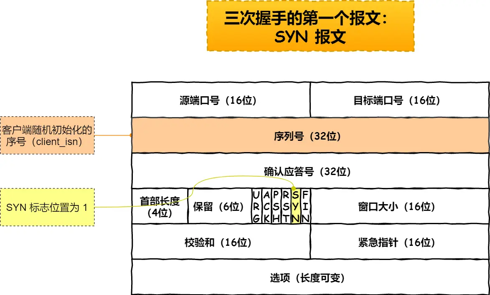

- 客户端会随机初始化序号（client_isn），将此序号置于 TCP 首部的「序号」字段中，同时把 SYN 标志位置为 1，表示 SYN 报文。接着把第一个 SYN 报文发送给服务端，表示向服务端发起连接，该报文不包含应用层数据，之后客户端处于 SYN-SENT 状态。


- 服务端收到客户端的 SYN 报文后，首先服务端也随机初始化自己的序号（server_isn），将此序号填入 TCP 首部的「序号」字段中，其次把 TCP 首部的「确认应答号」字段填入 client_isn + 1, 接着把 SYN 和 ACK 标志位置为 1。最后把该报文发给客户端，该报文也不包含应用层数据，之后服务端处于 SYN-RCVD 状态。


- 客户端收到服务端报文后，还要向服务端回应最后一个应答报文，首先该应答报文 TCP 首部 ACK 标志位置为 1 ，其次「确认应答号」字段填入 server_isn + 1 ，最后把报文发送给服务端，这次报文可以携带客户到服务端的数据，之后客户端处于 ESTABLISHED 状态。

- 服务端收到客户端的应答报文后，也进入 ESTABLISHED 状态。


从上面的过程可以发现**第三次握手是可以携带数据的，前两次握手是不可以携带数据的。**

一旦完成三次握手，双方都处于 ESTABLISHED 状态，此时连接就已建立完成，客户端和服务端就可以相互发送数据了


#### 4.2.2 TCP 四次挥手过程是怎样的？

双方都可以主动断开连接，断开连接后主机中的「资源」将被释放，四次挥手的过程如下图：


- 客户端打算关闭连接，此时会发送一个 TCP 首部 FIN 标志位被置为 1 的报文，也即 FIN 报文，之后客户端进入 FIN_WAIT_1 状态。
- 服务端收到该报文后，就向客户端发送 ACK 应答报文，接着服务端进入 CLOSE_WAIT 状态。
- 客户端收到服务端的 ACK 应答报文后，之后进入 FIN_WAIT_2 状态。
- 等待服务端处理完数据后，也向客户端发送 FIN 报文，之后服务端进入 LAST_ACK 状态。
- 客户端收到服务端的 FIN 报文后，回一个 ACK 应答报文，之后进入 TIME_WAIT 状态
- 服务端收到了 ACK 应答报文后，就进入了 CLOSE 状态，至此服务端已经完成连接的关闭。
- 客户端在经过 2MSL 一段时间后，自动进入 CLOSE 状态，至此客户端也完成连接的关闭。


你可以看到，每个方向都需要一个 **FIN** 和一个 **ACK**，因此通常被称为**四次挥手**。

这里一点需要注意是：**主动关闭连接的，才有 TIME_WAIT 状态**。